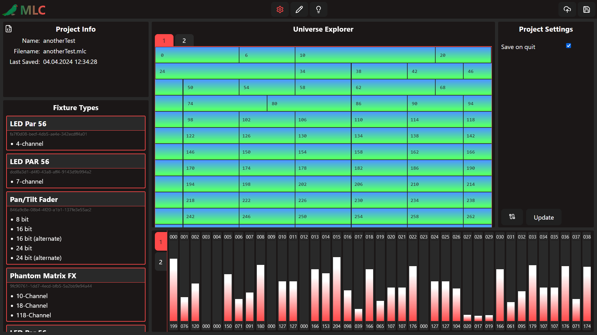

# Marvin Light Control

> [!NOTE]
> The image above was created before the rewrite was started.

Marvin Light Control (MLC for short) is a DmxShow creation and playback tool. It utilizes a timeline based approach to time and playback light and other stage effects. The Dmx protocol with its wide use cases and Network adaptions makes it highly compatible with most common stage fixtures. MLC can interface with different fixtures through endpoints, planned types of endpoints include sACN , ArtNet and Entec enabled USB-Interfaces.

> [!NOTE]
> MLC is in a pre-alpha state most of its features are only partially implemented, if at all, and the api and data structure will change. We do not recommend using MLC in any situations that go beyond playing around yet!

## Usage

While the Project is in early development no prebuilt executables are provided.

To run MLC on your local machine the following steps will help you:

1. Make sure you have Rust version 1.85 or newer installed on your machine
2. As the frontend toolkit MLC uses dioxus so to compile the fronted you have to install the dioxus-cli `cargo install dioxus-cli`
3. MLC contains a justfile to make the compilation process easier. Using just you can just clone the repo and run just r in the main directory. This will start both the server and the interface.
4. If you want to compile and run manually you need to:
    - First run the interface by moving into the mlc_interface directory and running dx serve
    - You then run then run MLC by moving back up into the parent dir and running cargo run --bin mlc_server from there.

## Reference / Roadmap

A more detailed reference on how MLC is built and a Roadmap is available at [marvinlightcontrol.de](https://marinlightcontrol.de)

## Feature requests / Contribution
If you have a feature you want to see in the Program or even think about implementing it yourself, feel free to open an issue describing your idea. We have a lot of ideas where we want to take MLC in the future and would love to discuss your ideas with you. The same is with bugs feel free to report any bugs you find, but keep in mind MLC is not nearly in a stable state so keeping the software 100% bug free is not a priority (yet).